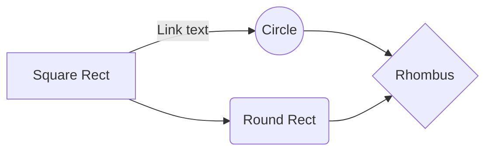

# initial_rep

Just checking this md file `features`

```
Is this a block
```

```python
# this is a python block
for i in range(44):
  print(i)
  
new_list = list()
new_list.append(2)
new_list.append(4)

var_new = [i for i in new_list if i != 3]
```
Maths

$$
\Gamma(z) = \int_0^\infty t^{z-1}e^{-t}dt\,.
$$

h<sub>&theta;</sub>(x) = &theta;<sub>o</sub> x + &theta;<sub>1</sub>x

```
 
```

flow-chart is below


